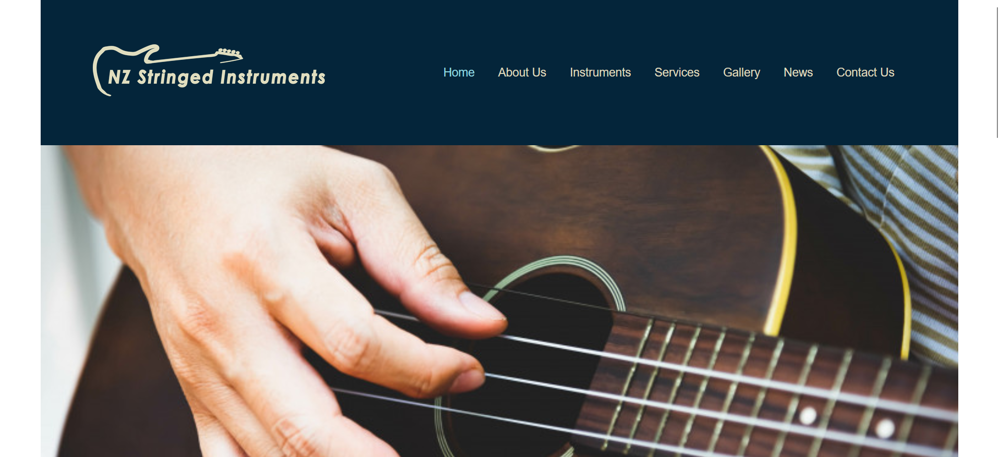

# New Zealand Stringed Instruments

[View Live](https://nzsi.flynnp4yne.com/)

I created the New Zealand Stringed Instruments website as an assignment at Ara Institute of Canterbury. My task was to merge the online presence of three separate instrument-making businesses into one streamlined website. To achieve this, I did an extensive content audit of the three existing websites. This audit helped the clients and me to gain a clear understanding of what content would stay on the new website.

Next, I developed prototypes and wireframes to visualize the website's structure and design. For the actual website development, I used Silverstripe CMS. This choice was deliberate, as it would let the clients easily manage and update the website's content without requiring extensive technical knowledge, as they aren't very technology savvy. Because of this, I also added additional functionality that made editing and adding content simpler. This extra functionality ensured the clients had a user-friendly experience when updating or adding new content to their site.

Overall this project took a whole semester to complete. If I had more time I would have added some extra functionailty on the back end to make it easier to update the contact form and also create or edit blog posts.

## Grades
This project was split over three classes. The grades I got are:
+ Website Specifications and Design: A+
+ Website Project: A+
+ Website Testing and Documentation: A-

## Languages
+ PHP

## License

[MIT](https://choosealicense.com/licenses/mit/)